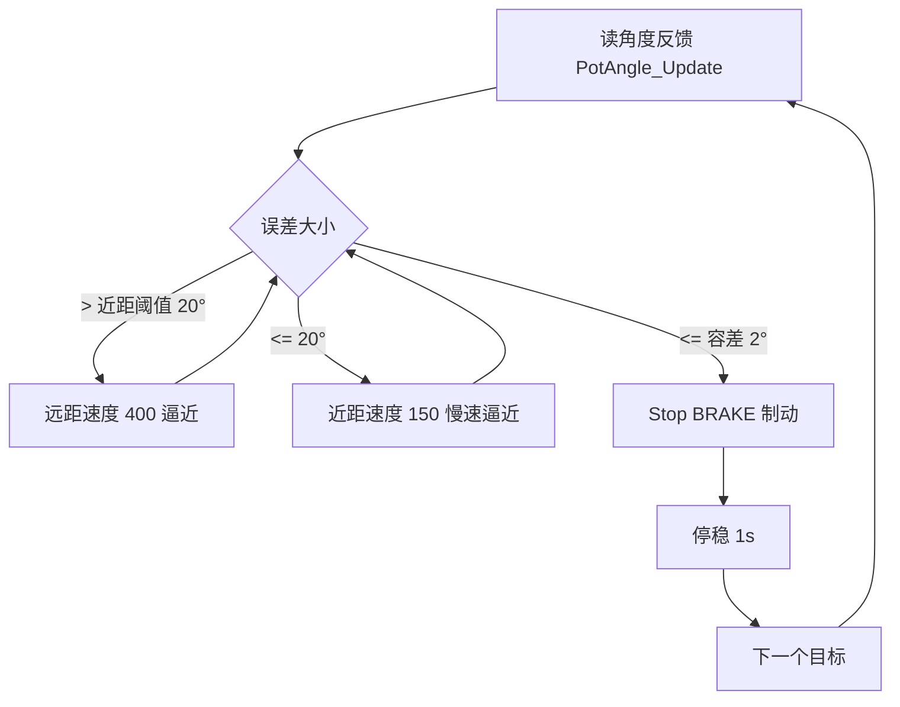

# AnglePositionTest —— 角度闭环定位联调案例

演示 **电位器角度反馈（PotAngle）+ 电机驱动（RZ7899）** 的闭环联调：
电机输出轴依次转到一串目标角度（默认 **30 → 60 → 90 → 120 → 150 → 200 → 260°**），
每步停稳 1s 后自动进入下一个，全部完成后保持在最后角度。

> 依赖本工程两个驱动库：`Drivers/RZ7899`（电机）与 `Drivers/PotAngle`（角度反馈）。
> 打包给别人时把这两个目录 + 本目录一起拷贝即可，代码零额外依赖。

## 硬件与前置配置

| 项目 | 说明 |
|---|---|
| 电机驱动 | RZ7899：TIM2_CH1/PA0→FI、TIM2_CH2/PA1→BI，20kHz PWM |
| 角度反馈 | 45kΩ 270° 电位器经 1k 串阻接 PA4 (ADC1_IN4)，**电机轴与电位器同轴耦合** |
| ADC | 采样时间 71.5 周期（见 `adc.c`，`.ioc` 已同步） |
| 电机标定 | `RZ7899_SetDutyLimits(&motor1, 540, 1000)`（履带电机实测值；换电机先标定死区） |
| 中断 | TIM2 更新中断每 50µs 推进 `RZ7899_Update()`（main.c 中自定义 handler） |

## 控制策略

每 1ms 一个控制周期，逻辑如下：



- **两段逼近**：远距用大速度、近距切慢速，减小冲击和过冲；
- **迟滞**：运行时误差 ≤ 2° 就停；停机后要偏出 4° 才重新启动，防止刹停瞬间在边界来回抖；
- **卡死看门狗**：电机"应该在靠近"期间，误差必须持续变小（≥2° 的进展），
  连续 3s 无进展（卡死/顶死/方向反）→ 制动停机并锁定 `fault=1`；
- 指令只在变化时下发：启动用 `RZ7899_Start()`（软斜坡），到点用 `RZ7899_Stop(BRAKE)`（急停）。

## 快速上手（main.c 集成示例）

```c
#include "angle_position_test.h"

AnglePositionTest_Handle pos_test; /* 全局句柄, Ozone 可直接 Watch 其字段 */

/* USER CODE 2: 三个库按顺序初始化 */
PotAngle_Init(&pot1, &hadc1);                       /* 角度反馈 */
RZ7899_Init(&motor1, &htim2, TIM_CHANNEL_1, TIM_CHANNEL_2); /* 电机 */
RZ7899_SetDutyLimits(&motor1, 540U, 1000U);         /* 电机标定映射 */
RZ7899_SetRampTimes(&motor1, 100U, 100U);
AnglePositionTest_Init(&pos_test, &motor1, &pot1);  /* 联调案例 */

/* while 循环: 1kHz 推进 (上电后自动跑序列) */
while (1)
{
    AnglePositionTest_Update(&pos_test);
    HAL_Delay(1);
}
```

## 参数（默认值可在头文件宏改，也可运行时直接改句柄字段）

| 宏 / 字段 | 默认 | 说明 |
|---|---|---|
| `ANGLE_POS_TEST_TOL_DEG` / `tol_deg` | 2 | 到位容差（°） |
| `ANGLE_POS_TEST_NEAR_DEG` / `near_deg` | 20 | 近距阈值（°），更近改用慢速 |
| `ANGLE_POS_TEST_SPEED_FAR` / `speed_far` | 400 | 远距速度刻度（映射后约 72% 占空比） |
| `ANGLE_POS_TEST_SPEED_NEAR` / `speed_near` | 150 | 近距速度刻度（太慢带不动会被看门狗判卡死） |
| `ANGLE_POS_TEST_DIR_SIGN` / `dir_sign` | +1 | **方向反了改成 -1**（或对调电机两根线） |
| `ANGLE_POS_TEST_STALL_MS` / `stall_ms` | 3000 | 卡死看门狗（ms） |
| `ANGLE_POS_TEST_DWELL_MS` / `dwell_ms` | 1000 | 每步停稳时间（ms） |
| `seq` / `seq_count` | 30…260 七步 | 目标序列，用 `AnglePositionTest_SetSequence()` 整体替换 |

## Ozone 观测字段（`pos_test.` 前缀）

| 字段 | 含义 |
|---|---|
| `step` | 当前步骤号（1~7，跑完停在 7） |
| `target_deg` | 当前目标角度 |
| `err_deg` | 误差 = 目标 − 实测（到位后应在 ±2 内） |
| `cmd` | 速度指令（0 = 已停稳） |
| `done` | 1 = 序列全部完成 |
| `fault` | 1 = 看门狗触发（排除问题后调 `AnglePositionTest_Restart()` 恢复） |

## ⚠️ 首次调试与安全

1. **上电即开始动作**（先奔 30°），保持随时可断电；
2. 若第一步就"往外跑"（`err_deg` 绝对值变大）→ 断电，把 `dir_sign` 改成 `-1`
   （或对调电机两根线）；不改的话看门狗会在 3s 内停机；
3. **260° 离电位器机械端（270°）只剩 10°**，确认机构能转到；
4. 看门狗停的是"电机"，但顶到限位的那一下无法避免——目标角度务必在行程内。

## 实测记录表（测试时填写）

| 目标 (°) | 实测停位 (°) | 末态误差 (°) | 备注 |
|---|---|---|---|
| 30 |  |  |  |
| 60 |  |  |  |
| 90 |  |  |  |
| 120 |  |  |  |
| 150 |  |  |  |
| 200 |  |  |  |
| 260 |  |  |  |
