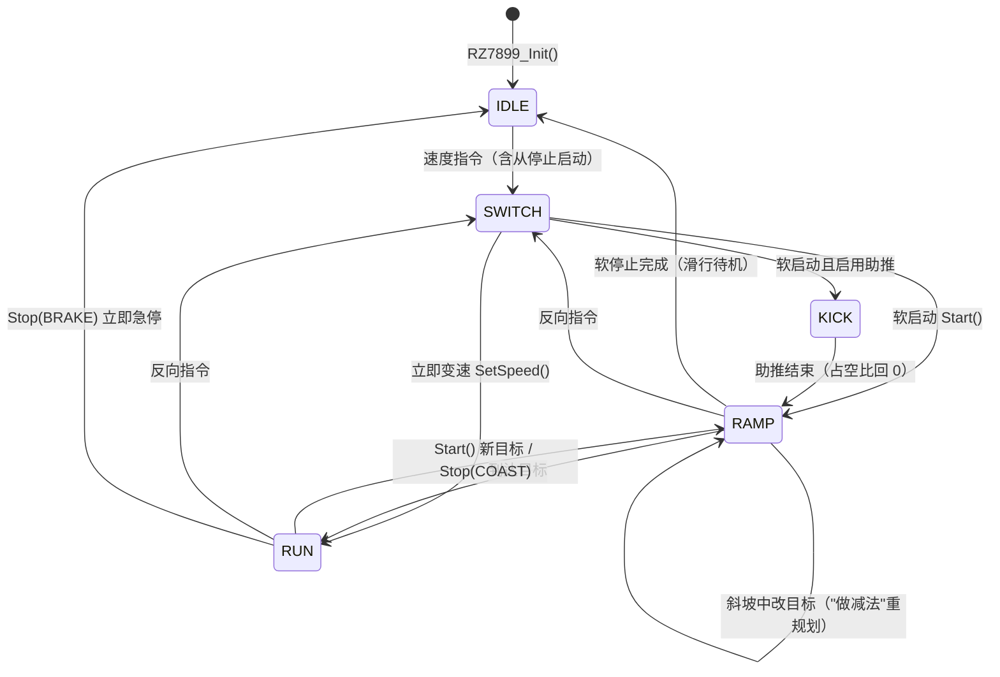

# RZ7899 双路 PWM 电机驱动库

面向 STM32 HAL 的 RZ7899 H 桥电机驱动库（双路 PWM 控制）。
所有接口**非阻塞**，内部以 PWM 周期为时间基准，由定时器更新中断驱动。

## 特性

- **非阻塞**：接口只"设定目标"；换向死区、启动助推、斜坡（含软停止）由
  `RZ7899_Update()` 每周期推进一步，主循环可以做别的事
- **软启动 / 软停止**：占空比线性斜坡；启停时间以 ms 定义，`RZ7899_Init()` 按
  **实测 PWM 频率自动换算**成周期数——改 CubeMX 定时器参数无需手动同步
- **安全换向**：方向改变先两路归零 → 等死区（默认 5ms）让绕组电流衰减 → 再开新方向
- **低速死区补偿 + 高速限幅**：把"启动阈值以下无效、只会嗡嗡响"的占空比映射掉，运行时标定
- **连续指令"做减法"**：斜坡中改目标不重新计时，用剩余预算重新规划，总时延有上界
- **多实例**：一个句柄对应一个电机，可共用或分用定时器
- **调试友好**：句柄字段（`state`、`duty`、`pwm_freq_hz`、`ramp_*_cycles` …）公开，调试器可直接观察

## 文件与构建集成

- `rz7899.h` — 类型、句柄与接口声明
- `rz7899.c` — 实现

根 `CMakeLists.txt` 已将 `Drivers` 加入扫描列表，且 GLOB 带 `CONFIGURE_DEPENDS`，
新增文件后重新构建会自动纳入编译与头文件路径，无需改动 CMake。

## 接口

```c
bool RZ7899_Init(RZ7899_Handle *motor, TIM_HandleTypeDef *htim,
                 uint32_t forward_channel, uint32_t reverse_channel);
bool RZ7899_SetDutyLimits(RZ7899_Handle *motor, uint16_t min_duty, uint16_t max_duty);
bool RZ7899_SetRampTimes(RZ7899_Handle *motor, uint16_t start_ms, uint16_t stop_ms); // 运行时可改启停时间(ms)
void RZ7899_Start(RZ7899_Handle *motor, int16_t speed);      // 平滑启动(斜坡+可选助推)
void RZ7899_SetSpeed(RZ7899_Handle *motor, int16_t speed);   // 立即变速 -1000~+1000
void RZ7899_Update(RZ7899_Handle *motor);                    // 状态机推进: 每调用 = 1 个 PWM 周期
void RZ7899_Stop(RZ7899_Handle *motor, RZ7899_StopMode mode);     // COAST=软停止(斜坡降速), BRAKE=立即急停
void RZ7899_DeInit(RZ7899_Handle *motor);
RZ7899_Direction RZ7899_GetDirection(const RZ7899_Handle *motor);
uint16_t RZ7899_GetSpeed(const RZ7899_Handle *motor);
```

> 全部接口均为**非阻塞**（函数内部不含任何延时）：接口只"设定目标"，
> 换向死区、启动助推、斜坡（含软停止）都由 `RZ7899_Update()` **按 PWM 周期**推进
> （每次调用 = 经过一个 PWM 周期，建议在定时器更新中断里调用）。

## 快速上手

```c
#include "rz7899.h"

RZ7899_Handle motor1;

MX_TIM2_Init();                           // CubeMX: 两通道 PWM Generation, 初始 Pulse=0
RZ7899_Init(&motor1, &htim2, TIM_CHANNEL_1, TIM_CHANNEL_2); // CH1->FI, CH2->BI
RZ7899_SetDutyLimits(&motor1, 100, 800);  // 输出占空比限制在 10%~80%
RZ7899_SetRampTimes(&motor1, 100, 100);   // 启停斜坡各 100ms (可选; 默认就是 100)

RZ7899_Start(&motor1, 300);               // 软启动(斜坡), 实际约 31%
RZ7899_SetSpeed(&motor1, 800);            // 立即提速, 实际约 66%
RZ7899_Stop(&motor1, RZ7899_STOP_COAST);  // 软停止: 斜坡降到 0 后滑行
RZ7899_Start(&motor1, -500);              // 反向软启动(先 5ms 死区再斜坡), 实际约 45%
RZ7899_Stop(&motor1, RZ7899_STOP_BRAKE);  // 急停: 立即短路制动
RZ7899_Stop(&motor1, RZ7899_STOP_COAST);  // 松开刹车, 转滑行待机

while (1)
{
    ...
}

// 时间基准: 在 TIM 更新中断里调用 Update (每调用一次 = 经过 1 个 PWM 周期)
void TIM2_IRQHandler(void)
{
    if (__HAL_TIM_GET_FLAG(&htim2, TIM_FLAG_UPDATE) != RESET)
    {
        __HAL_TIM_CLEAR_FLAG(&htim2, TIM_FLAG_UPDATE);
        RZ7899_Update(&motor1);
    }
}
```

## 占空比映射（低速死区 / 高速限幅）

```
实际输出占空比 = min_duty + (max_duty - min_duty) × |指令| / 1000
```

- `min_duty`：低速死区。低于电机启动阈值的占空比只会"嗡嗡响不转"，映射后指令 1 即输出 `min_duty`；
- `max_duty`：高速限幅。降低电源跌落、峰值电流和 RZ7899 发热，代价是最高转速/转矩下降；
- 例：`min_duty=100`（10%）、`max_duty=800`（80%）时，指令 200 → 实际 24%，指令 1000 → 实际 80%；
- 死区必须实测标定：从 0 慢慢加占空比，记录能稳定起转的刻度，再留 3~5 个刻度余量；
- 制动固定 100%，不经过该映射。

## 状态机：启动 / 变速 / 换向 / 停止（全部非阻塞）

接口函数内部**没有任何延时**，只"设定目标"；实际动作由 `RZ7899_Update()` **逐 PWM 周期**推进：

| 状态 | 行为 | 耗时（PWM 周期） |
|------|------|----------------|
| `STATE_IDLE` | 空闲（输出 0%；制动保持时也是本状态） | — |
| `STATE_SWITCH` | 两路归零，等待绕组电流衰减 | `RZ7899_DIR_SWITCH_CYCLES`（默认 100 = 5ms） |
| `STATE_KICK` | 满占空比助推（可选） | `RZ7899_START_KICK_CYCLES` |
| `STATE_RAMP` | 在剩余预算内线性逼近目标（升/降速/软停止共用） | 启停时间（`*_RAMP_MS`）换算的周期数 / 剩余预算 |
| `STATE_RUN` | 已到达目标 | — |



> 换算：20kHz 时 1 周期 = 50µs；100 周期 = 5ms，2000 周期 = 100ms。

- `RZ7899_SetSpeed()`：同方向立即到位；方向改变时先归零，死区周期数到后立即加载新占空比；
- `RZ7899_Start()`：同方向从当前占空比斜坡到新目标；方向改变/从停止启动时走"死区 →（可选助推）→ 斜坡"；
- `RZ7899_Stop(COAST)`：**软停止** — 从当前占空比在“停止斜坡时间”（默认 100ms，`RZ7899_SetRampTimes` 可改）内降到 0，然后滑行；
- `RZ7899_Stop(BRAKE)`：**急停** — 立即两路 100% 短路制动，不经过斜坡。

### 连续指令（斜坡中改目标）— 不重新计时，"做减法"

斜坡进行中又收到新指令（含停止）时，复用本段斜坡的剩余预算：

```
剩余预算 = ramp_total - cycles          // 本段总预算 - 已用周期
新计划   = 当前占空比 -> 新目标，在剩余预算内线性到达
```

例（预算 2000 周期 = 100ms）：t=0 发"降到 699"，t=200 周期（10ms）时改"升到 800"：
此时占空比约 768，用剩余 1800 周期完成到 800 —— 从第一条指令起仍共 100ms。
若改成"每条指令重新计 2000 周期"，连续下发时总时延会无限延长，电机永远追不上目标。

## 时间与频率：全自动换算（不用填频率）

`RZ7899_Init()` 会从 `htim` 自动读出 **PSC、ARR 和定时器时钟**（RCC 当前实际配置，含 APB1/APB2 的 ×2 规则），算出实际 PWM 频率，再把“时间（ms）”换算成周期数：

```
周期数 = 时间(ms) × 实测频率(Hz) / 1000
```

**改了 CubeMX 里的 PSC/ARR 也不需要手动同步任何数字。**

启动/停止时间默认 100ms（头文件里的 `RZ7899_START_RAMP_MS` / `RZ7899_STOP_RAMP_MS`），
运行时可以随时改：

```c
RZ7899_SetRampTimes(&motor1, 100, 100);   // 启动 100ms, 停止 100ms
```

| 时间 | 20kHz 时对应周期数 |
|------|-------------------|
| 1ms | 20 |
| 5ms | 100 |
| 50ms | 1000 |
| 100ms | 2000 |
| 200ms | 4000 |

参数配置（默认值定义在 `rz7899.h`；启停时间可在运行时用 `RZ7899_SetRampTimes` 修改。
注意：在 `main.c` 里 `#define` **不会**影响库内部——C 语言各 `.c` 文件独立预处理）：

| 宏 | 默认 | 说明 |
|----|------|------|
| `RZ7899_START_RAMP_MS` | 100 | 启动斜坡时间（ms）默认值（`Init` 采用；运行时用 `RZ7899_SetRampTimes` 修改） |
| `RZ7899_STOP_RAMP_MS` | 100 | 停止斜坡时间（ms）默认值，同上 |
| `RZ7899_DIR_SWITCH_CYCLES` | 100（5ms @20kHz） | 换向死区周期数（按周期定义） |
| `RZ7899_START_KICK_CYCLES` | 0（关闭） | 助推周期数；卡死起不来时试 1000~2000 |
| `RZ7899_START_KICK_DUTY` | 1000（100%） | 助推占空比 |

## 设计约束（实现中始终遵守）

- 不写死定时器/引脚，全部由 `RZ7899_Init` 参数传入
- CubeMX 初始 Pulse=0；`Init` 中两路 CCR 先归零再启动 PWM
- 反向前：两路 CCR 先归零 → 由 `RZ7899_Update()` 计满 `RZ7899_DIR_SWITCH_CYCLES` 个 PWM 周期 → 再开新方向
- 软停止：先从当前占空比按“停止斜坡时间”（默认 100ms）降到 0，再滑行（FI=0、BI=0）；制动：立即 FI=100%、BI=100%
- 除制动外，任何时刻不允许两路同时输出非零占空比
- 指令刻度 1~1000 线性映射到 `min_duty`~`max_duty`（默认 0~1000，即不映射）
- **库函数内部无任何延时**；`RZ7899_Update()` 每调用一次 = 一个 PWM 周期，
  需放在定时器更新中断中调用（见"快速上手"），否则死区/助推/斜坡都不会推进
- 所有 CCR 写入只发生在状态转换点与逐周期斜坡步进中；句柄字段公开，
  调试器里可以直接观察 `state` / `duty` / `pwm_freq_hz` / `ramp_*_cycles`

## 硬件连接（当前工程）

| STM32 | RZ7899 | 说明 |
|-------|--------|------|
| PA0 / TIM2_CH1 | FI (Pin2) | 正转输入 |
| PA1 / TIM2_CH2 | BI (Pin1) | 反转输入 |
| GND | GND | 必须共地 |

TIM2：PSC=0、ARR=3599 → 20 kHz（72 MHz / 3600），频率由 `RZ7899_Init` 自动读取。

RZ7899 真值表：

| FI | BI | 输出 |
|----|----|------|
| 0 | 0 | FO/BO 高阻（滑行停止） |
| PWM | 0 | 正转（平均电压 ≈ 电机电源 × 占空比） |
| 0 | PWM | 反转 |
| 1 | 1 | FO/BO 短接（快速制动） |

## 本工程参数与演示流程（main.c）

| 项 | 值 |
|----|----|
| PWM | TIM2，20kHz（PSC=0、ARR=3599）；频率由 `RZ7899_Init` 从 htim 自动读取 |
| 启动/停止斜坡 | 各 100ms（`main.c` 中 `RZ7899_SetRampTimes` 设置；自动换算 2000 周期） |

### 电机标定参数（定义在 `rz7899.h`）

| 宏 | 电机 | 当前值 | 状态 |
|----|------|--------|------|
| `RZ7899_MOTOR_WORM_MIN/MAX_DUTY` | 小型蜗杆减速电机 | 550 / 1000 | **已标定**：实测 55% 起转（50% 不行），此前测试一直用这组值 |
| `RZ7899_MOTOR_TRACK_MIN/MAX_DUTY` | 履带驱动直流电机 | 540 / 1000 | **已标定**：实测约 540 可稳定起转（从 550 继续下探所得） |

> 蜗杆电机的映射：`实际 = 550 + 450 × 速度 / 1000`（反算 `速度 = (实际 − 550) × 1000 / 450`）。
> 履带电机的映射：`实际 = 540 + 460 × 速度 / 1000`；若最低速启动偶发吃力，可把 min 上调 3~5（如 545）。

### 当前测试：履带电机死区（最低启转刻度）扫描

> **标定结果：约 540**（扫描 300~600、每档 +10 下探所得），已写入
> `RZ7899_MOTOR_TRACK_MIN_DUTY`。

标定模式关闭了补偿映射（`SetDutyLimits(0, 1000)`），**速度刻度直接等于实际占空比**。

主循环从 `RZ_SCAN_START`（300‰）到 `RZ_SCAN_END`（600‰）、每档 +10：
先 `Stop` 停稳 → 以该刻度 `SetSpeed` 启动并保持 1.5s → 观察是否稳定起转
（没起转的档位电机会轻微嗡嗡响，属正常）。

复核或再标定：把 `RZ_SCAN_STEP` 改成 5（或缩小范围，如 500~560）。
恢复正常映射：把 `main.c` 的 `SetDutyLimits(0, 1000)` 换回 `SetDutyLimits(RZ_MIN_DUTY, RZ_MAX_DUTY)`。

## 待扩展

- 堵转检测（需外加分流电阻/电流放大器/编码器，RZ7899 无故障输出）
- 速度闭环（编码器 + PID）：`Update()` 已提供稳定周期节拍，`duty` 可直接作为输出量
- S 曲线斜坡（当前为线性斜坡）
- 多电机联动（每电机一个句柄；注意共用电源时的电流预算）
